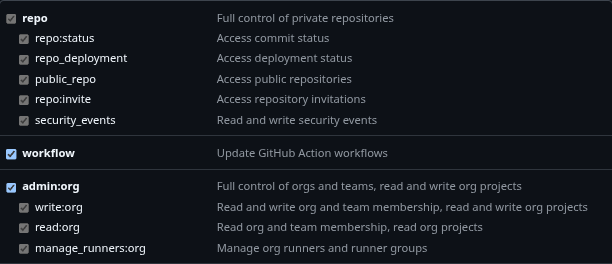

# AI-Grader

AI-Grader is a CLI tool that automates grading of Java assignments for KTH courses DD1337 and DD1338. It streamlines the workflow for TAs by handling repository cloning, test execution, AI-based grading (using OpenAI or Google Gemini), and feedback posting.

## Table of Contents

- [Features](#features)
- [Installation](#installation)
- [Configuration](#configuration)
- [Usage](#usage)
- [API Integration](#api-integration)
- [Examples](#examples)
- [Directory Structure](#directory-structure)
- [Troubleshooting](#troubleshooting)
- [Contributing](#contributing)
- [License](#license)
- [Credits](#credits)

## Features

- Clone student repositories and solution repositories from GitHub
- Compile and test student Java assignments using JUnit/Hamcrest
- Grade assignments using OpenAI or Google Gemini via a Python FastAPI service
- Post feedback to GitHub issues automatically
- Print test results and AI-generated feedback in the terminal

## Installation

### System Requirements

- Linux or MacOS (tested on Arch Linux and Ubuntu VM)
- Rust (via [rustup](https://rustup.rs/))
- Python 3.9+
- Java JDK (javac, java)
- Git

### Dependencies

#### Git

To use this tool, you must set up an SSH key for authenticating with the inda-organization on GitHub.

1. **Generate an SSH key:**
   Follow the official guide:
   [How to generate an SSH key](https://docs.github.com/en/authentication/connecting-to-github-with-ssh/generating-a-new-ssh-key-and-adding-it-to-the-ssh-agent)

2. **Add your SSH key to GitHub:**
   See instructions here:
   [How to add an SSH key to your GitHub account](https://docs.github.com/en/authentication/connecting-to-github-with-ssh/adding-a-new-ssh-key-to-your-github-account)

**Tip:**
Make sure your SSH key is added to your SSH agent and associated with your GitHub account before running any commands that clone repositories(Try to clone repositories repository manually beforehand to make sure it works. One from inda-master and one from inda-25).


#### Rust

The recommended way to install Rust is via [rustup](https://rustup.rs/):

```sh
curl --proto '=https' --tlsv1.2 -sSf https://sh.rustup.rs | sh
```

Follow the on-screen instructions.
After installation, ensure Rust is available by running:

```sh
rustc --version
cargo --version
```

#### Python

**Install Python (3.9 or newer):**

On Linux (Arch example):
```sh
sudo pacman -S python python-pip
```

On Ubuntu/Debian:
```sh
sudo apt-get update
sudo apt-get install python3 python3-pip
```

Install with `pip` (in a virtual environment if pip is blocked like on arch linux(pain in the ass and not recommended but if you want to use gemini on arch you will need to set up virtual environment. Instructions are below)):

```sh
pip install fastapi uvicorn openai pydantic google-genai google-generativeai
```
**On arch use pacman packages instead(pip packages can no longer be installed to the system root):**

```sh
sudo pacman -Syu python-fastapi uvicorn python-openai python-pydantic
```

#### External

- JUnit (`junit-4.12.jar`)
- Hamcrest (`hamcrest-core-1.3.jar`)
- Place these in a directory (e.g., `/home/inda-master/jars`)
- There is also a directory [jars](jars) which contains hamcrest and junit jar that you can use instead.

### Build the CLI

To build the CLI tool, run:

```sh
cargo build        # for development
cargo build --release   # for optimized release build
```

### Automated Installation

The easiest way to install AI-Grader is to use our installation script:

```sh
# Clone the repository (if you haven't already)
git clone https://github.com/EdgyGuy19/AI-Grader.git
cd AI-Grader

# Run the installation script
./install.sh
```

The installation script will:
1. Detect your operating system and package manager
2. Install all necessary dependencies (Python, Rust, Java, Git, etc.)
3. Set up a Python virtual environment
4. Set up a Python virtual environment in the AI_api directory
5. Build and install the AI-Grader CLI globally
6. Configure your PATH to make the `grader` command available

This script has been tested on both Arch Linux and Ubuntu virtual machines to ensure cross-distribution compatibility.

**Important:** After installation, you should **restart your terminal** or open a new terminal window to ensure all PATH changes are applied.

After restarting your terminal:
1. Set up your API keys if you haven't already:
   ```sh
   export GITHUB_TOKEN=your_github_token
   export GRADER_OPENAI_API_KEY=your_openai_api_key
   # Or if using Gemini:
   # export GRADER_GEMINI_API_KEY=your_gemini_api_key
   ```

2. Run grader commands from anywhere:
   ```sh
   # Examples:
   grader help
   grader clone -s students.txt -t task-1 -o ./output
   ```

**Note:** On some Debian/Ubuntu systems, you may need to install additional dependencies:
```sh
sudo apt-get install pkg-config libssl-dev
```

### Manual Installation

If you prefer to install manually, follow these steps:

#### Global installation

To install the grader CLI globally, run from the repository:

```sh
cargo install --path .
```

This will place the `grader` binary in `~/.cargo/bin` (make sure this directory is in your `PATH`).
After installation, you can run `grader` from any directory:

```sh
grader help
```

If the command does not work try to add this to your `.bashrc`, `.zshrc`, or equivalent:

```sh
export PATH="$HOME/.cargo/bin:$PATH"
```

Alternatively, you can build and copy manually:

```sh
cargo build --release
sudo cp target/release/grader /usr/local/bin/grader
```

**Note:**
- Your binary will be named `grader` (from `[package] name = "grader"`).
- If you want the command to be something else, rename your package in `Cargo.toml` to `WhatEverYouWant` or copy the binary as shown above.

## Configuration

### Environment Variables

Guide for setting up environment variables: [How to set environment variables](https://www.twilio.com/en-us/blog/how-to-set-environment-variables-html)

### Getting API Keys

#### OpenAI API Key
How to get your own OpenAI API key:[Guide for creating API Key](https://medium.com/@lorenzozar/how-to-get-your-own-openai-api-key-f4d44e60c327)

### Creating a GitHub Token

To create a GitHub token:

1. Go to [GitHub Settings > Developer settings > Personal access tokens](https://github.com/settings/tokens).
2. Click "Generate new token".
3. Select the required scopes (e.g., `repo`, `workflow`).
4. Copy and save your token securely.

For more details, see [GitHub Docs: Creating a personal access token](https://docs.github.com/en/github/authenticating-to-github/creating-a-personal-access-token).


### Set these before running the CLI:

```sh
export AI_GRADER_ROOT=/path/to/AI-Grader/project/directory
export AI_GRADER_JARS_DIR=/path/to/jars/directory
export GITHUB_TOKEN=your_github_token
export GRADER_OPENAI_API_KEY=your_openai_api_key
# If using Gemini model:
export GRADER_GEMINI_API_KEY=your_gemini_api_key
```

**Important:** The `AI_GRADER_ROOT` variable must point to the directory containing the `AI_api` folder. This is required for the `grade` command to work from any directory.

#### Google Gemini API Key

To use the Google Gemini model:
1. Go to [Google AI Studio](https://makersuite.google.com/app/apikey)
2. Create a new API key
3. Save it securely and add it to your environment variables as shown above
4. Set up a Python virtual environment for Gemini(In a virtual environment if on arch):

**These commands below are only if you want to run gemini in virtual environment(needed on arch). Do not use these if it is not required by your OS. Run these commands from AI_api directory.**
```sh
cd AI_api
python -m venv venv
source venv/bin/activate
pip install google-generativeai fastapi uvicorn pydantic
cd ..
```

**Note for non-Arch Linux systems:** If your system allows installing Python packages globally, you can skip the virtual environment setup and install the required packages directly:

```sh
# For Ubuntu/Debian and other systems where global pip installations work:
pip install google-generativeai fastapi uvicorn pydantic
```

The code includes commented sections for running without a virtual environment that you can uncomment if needed.

### Input Files

To use the cli you will need to create a .txt file with kth ids of all the students in your group.
**IMPORTANT! Only 1 name per line in the file, no spaces, no @kth.se**

- `students.txt`: List of student usernames
    ```
    alice
    bob
    charlie
    # Each line should contain a student kth_ID.
    ```

## Usage

### CLI Commands

- `clone`     - Clone student repositories and create a JSON file with src paths.
- `tests`     - Clone all solution repos from inda-master into a specified output directory.
- `java`      - Compile and test all student Java files, collect results, and create JSON payloads.
- `results`   - Print test results from JSON file(s) in a clear terminal format.
- `grade`     - Send JSON payloads to the Python AI API for grading and post feedback to GitHub. Supports both OpenAI and Google Gemini models.
- `feedback`  - Print AI-generated feedback from JSON file(s) in a clear terminal format.
- `issues`    - Check GitHub issues for students' repositories and display their status (PASS, FAIL, KOMP, KOMPLETTERING).

### Help Output

Run `grader help` to see all commands, options and how each command works.

## API Integration

The Rust CLI interacts with a Python FastAPI service for grading.

### Start the API Server

The server starts up automatically with the grade command and shuts down after the last student has been graded.

The server should run at `http://127.0.0.1:8000/grade_gpt` or `http://127.0.0.1:8000/grade_gemini` depending on which model you choose.

## Examples

```sh
# Clone student repos for a task
grader clone -s students.txt -t task-1 -o ./output
# or with long options:
grader clone --students students.txt --task task-1 --output ./output

# Clone solution repos for all tasks
grader tests -o ./solutions
# or with long options:
grader tests --output ./solutions

# Compile and test student Java files, create JSON payloads
grader java -j ./output/task-1/src_paths.json -o ./output/task-1/compiled -t ./solutions/task-1/src --jars ./jars
# or with long options:
grader java --json ./output/task-1/src_paths.json --output ./output/task-1/compiled --tests ./solutions/task-1/src --jars ./jars

# Print test results from JSON files
grader results -j ./output/task-1/compiled/json_files
# or with long options:
grader results --json ./output/task-1/compiled/json_files

# Grade assignments using the AI API and post feedback to GitHub
# Using default OpenAI model:
grader grade -j ./output/task-1/compiled/json_files -o ./feedback
# Using Google Gemini model:
grader grade -j ./output/task-1/compiled/json_files -o ./feedback -m gemini
# or with long options:
grader grade --json ./output/task-1/compiled/json_files --output ./feedback --model gemini
# (On Arch Linux, this requires a virtual environment. On other systems, you can modify github_api.rs to use system Python)

# Print AI-generated feedback from JSON files
grader feedback -j ./feedback
# or with long options:
grader feedback --json ./feedback

# Check issue statuses for students in a task
grader issues -s students.txt -t task-1
# or with long options:
grader issues --students students.txt --task task-1


```
**Note:**
When compiling and running tests, any student-written test files (e.g., `*Test.java`) are moved to a `student_tests/` directory to avoid conflicts with the provided tests.

## Directory Structure

```
AI-Grader/
├── src/
│   ├── main.rs          # Rust main file where we call all functions
│   ├── github_api.rs    # Rust file with all the functions that are used in the main.rs
│   └── json_parser.rs   # Rust file containing JSON formats and functions for formatting to JSON
├── AI_api/
│   ├── gptAPI.py        # File for the OpenAI grading API
│   └── geminiAPI.py     # File for the Google Gemini grading API
├── jars/                # JUnit/Hamcrest jars
└── install.sh           # Installation script for automated setup
```

## Troubleshooting

- **Java compilation failed:** Ensure JDK and JAR files are present and paths are correct.
- **API errors:** Make sure the FastAPI server is running and the appropriate API key is set (OpenAI or Gemini).
- **GitHub issue creation fails:** Check your `GITHUB_TOKEN` and repo permissions.
- **Missing dependencies:** Double-check installation steps above.
- **Command not found:** Make sure you installed the CLI globally and your binary name matches (`cli` or `grader`). Check that `~/.cargo/bin` is in your `PATH`.
- **Missing environment variables:** Ensure you have set `AI_GRADER_ROOT`, `GITHUB_TOKEN`, `AI_GRADER_JARS_DIR`, and either `GRADER_OPENAI_API_KEY` or `GRADER_GEMINI_API_KEY` (depending on your chosen model) before running the CLI.
- **Gemini API errors:** If using the Gemini model, make sure you've set up the virtual environment correctly with `python -m venv venv` and installed the required packages. On non-Arch Linux systems, you can also modify the code to run without a virtual environment (see the commented code in `github_api.rs`).
- **Build errors on Debian/Ubuntu:** If you encounter SSL-related errors during build, install required development packages: `sudo apt-get install pkg-config libssl-dev`
- **Virtual environment issues:** If you encounter Python package import errors, make sure the virtual environment in the AI_api directory is set up correctly with all required packages
- **After installation:** Remember to restart your terminal or open a new terminal window after installation to ensure PATH changes take effect
- **Re-installing:** If you need to reinstall or update dependencies, run the install script again: `./install.sh`

- **If the error persists contact me via slack or create a github issue!!!:**

## Contributing

Pull requests are welcome!
Please format Rust code with `cargo fmt` and Python code with `black` before submitting pull requests.
Open issues for bugs or feature requests.

## License

MIT

## Credits

- Contributors: Edgar Palynski: [EdgyGuy19](https://github.com/EdgyGuy19)
- Libraries: clap, serde, reqwest, tokio, fastapi, openai, google-generativeai, google-genai, pydantic
- Inspired by hating repobee(shoutout)
