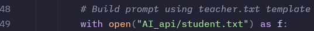
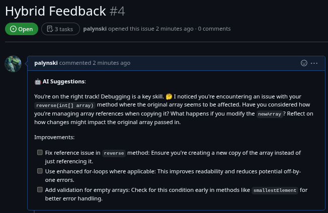
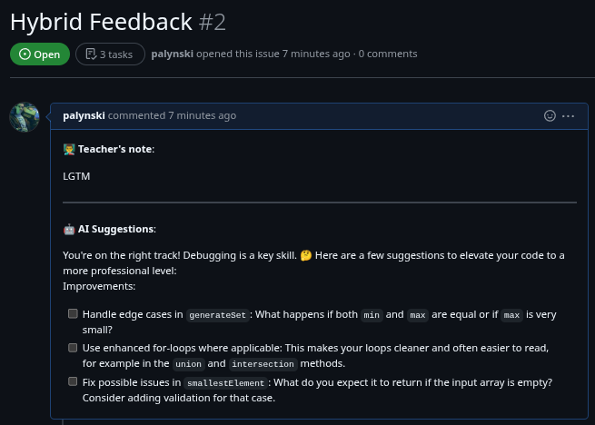

# Assistant Moderated AI-Generated Insights(IMAGI)

IMAGI is a CLI tool that automates grading of Java assignments for KTH courses DD1337 and DD1338. It streamlines the workflow for TAs by handling repository cloning, test execution, AI-based grading (using OpenAI or Google Gemini), and feedback posting.

## Table of Contents

- [Features](#features)
- [Installation](#installation)
  - [System Requirements](#system-requirements)
  - [Automated Installation (Recommended)](#automated-installation-recommended)
    - [Prerequisites](#prerequisites)
  - [Manual Installation](#manual-installation)
- [Configuration](#configuration)
  - [Prompt Templates Customization](#prompt-templates-customization)
  - [Environment Variables](#environment-variables)
  - [API Keys and Tokens](#api-keys-and-tokens)
  - [Getting API Keys](#getting-api-keys)
    - [OpenAI API Key](#openai-api-key)
    - [Google Gemini API Key](#google-gemini-api-key)
  - [Creating a GitHub Token](#creating-a-github-token)
  - [Input Files](#input-files)
- [Usage](#usage)
  - [CLI Commands](#cli-commands)
  - [Example of Posted GitHub Issues](#example-of-posted-github-issues)
  - [Help Output](#help-output)
- [API Integration](#api-integration)
- [Examples](#examples)
- [Directory Structure](#directory-structure)
- [Troubleshooting](#troubleshooting)
- [Contributing](#contributing)
- [License](#license)
- [Credits](#credits)

## Features

- Clone student repositories and solution repositories from GitHub
- Compile and test student Java assignments using JUnit/Hamcrest
- Give feedback to assignments using OpenAI or Google Gemini via a Python FastAPI service
- Post feedback to GitHub issues automatically
- Print test results and AI-generated feedback in the terminal

## Installation

There are two methods to install IMAGI:
1. **Automated Installation** (recommended): A single script that detects your OS, installs dependencies, and configures everything
2. **Manual Installation**: Step-by-step instructions if you need more control over the installation process

### System Requirements

- Linux or MacOS (tested on Arch Linux and Ubuntu VM)
- Windows Subsystem for Linux (WSL) is also supported
- Rust (via [rustup](https://rustup.rs/))
- Python 3.9+
- Java JDK (javac, java)
- Git

### Automated Installation (Recommended)

#### Prerequisites

Before running the automated installation script, please ensure you have:

1. **SSH key set up for GitHub**: Required for authenticating with GitHub repositories
   - Generate an SSH key: [GitHub Guide: Generating a new SSH key](https://docs.github.com/en/authentication/connecting-to-github-with-ssh/generating-a-new-ssh-key-and-adding-it-to-the-ssh-agent)
   - Add it to your GitHub account: [GitHub Guide: Adding a new SSH key](https://docs.github.com/en/authentication/connecting-to-github-with-ssh/adding-a-new-ssh-key-to-your-github-account)
   - Test your SSH connection: `ssh -T git@github.com`

2. **Access permissions** to:
   - `inda-master` organization repositories (for solution code)
   - `inda-xx` organization repositories (for student submissions, where "xx" is the year number, e.g., "inda-25")

   **Note:** The organization name `inda-xx` is hardcoded in the application. You will need to modify the source code to update this value each academic year in the following locations:
   - `src/github_api.rs`, line ~45: `let base_url = "git@gits-15.sys.kth.se:inda-25/";`
   - `src/github_api.rs`, line ~612: `let org = "inda-25";`
   - `src/github_api.rs`, line ~682: `let org = "inda-25";`

The easiest way to install IMAGI is to use our installation script:

```sh
# Clone the repository (if you haven't already)
git clone https://github.com/EdgyGuy19/IMAGI.git
cd IMAGI

# Make sure the script is executable (if needed)
chmod +x install.sh

# Run the installation script
./install.sh
```

The installation script will:
1. Detect your operating system and package manager
2. Install all necessary dependencies (Python, Rust, Java, Git, etc.)
3. Set up a Python virtual environment
4. Set up a Python virtual environment in the AI_api directory
5. Build and install the IMAGI CLI globally
6. Configure your PATH to make the `imagi` command available

This script has been tested on both Arch Linux and Ubuntu virtual machines to ensure cross-distribution compatibility.

**Important:** After installation, you should **restart your terminal** or open a new terminal window to ensure all PATH changes are applied.

After restarting your terminal:
1. Set up your API keys and Github Token if you haven't already:
   ```sh
   export GITHUB_TOKEN=your_github_token
   export IMAGI_OPENAI_API_KEY=your_openai_api_key
   # Or if using Gemini:
   # export IMAGI_GEMINI_API_KEY=your_gemini_api_key
   ```

2. Run IMAGI commands from anywhere:
   ```sh
   # Examples:
   imagi help
   imagi clone -s students.txt -t task-1 -o ./output -u ./unitTest/src
   ```

**Note:** On some Debian/Ubuntu systems, you may need to install additional dependencies:
```sh
sudo apt-get install pkg-config libssl-dev
```

### Manual Installation

If you prefer to install IMAGI manually or need more control over the installation process, follow these detailed steps:

#### 1. Set up Git SSH Authentication

To use this tool, you must set up an SSH key for authenticating with the inda-organization on GitHub.

1. **Generate an SSH key:**
   Follow the official guide:
   [How to generate an SSH key](https://docs.github.com/en/authentication/connecting-to-github-with-ssh/generating-a-new-ssh-key-and-adding-it-to-the-ssh-agent)

2. **Add your SSH key to GitHub:**
   See instructions here:
   [How to add an SSH key to your GitHub account](https://docs.github.com/en/authentication/connecting-to-github-with-ssh/adding-a-new-ssh-key-to-your-github-account)

**Tip:**
Make sure your SSH key is added to your SSH agent and associated with your GitHub account before running any commands that clone repositories. Try to clone repositories manually beforehand to ensure it works (one from inda-master and one from inda-25).

#### 2. Install Rust

The recommended way to install Rust is via [rustup](https://rustup.rs/):

```sh
curl --proto '=https' --tlsv1.2 -sSf https://sh.rustup.rs | sh
```

Follow the on-screen instructions.
After installation, ensure Rust is available by running:

```sh
rustc --version
cargo --version
```

#### 3. Install Python and Dependencies

**Install Python (3.9 or newer):**

On Linux:
```sh
# Ubuntu/Debian
sudo apt-get update
sudo apt-get install python3 python3-pip
# Arch Linux
sudo pacman -S python python-pip

# Fedora
sudo dnf install python3 python3-pip
```

**Install Python packages using a virtual environment:**

```sh
# Create and activate virtual environment
cd AI_api
python -m venv venv
source venv/bin/activate

# Install required packages
pip install fastapi uvicorn openai pydantic google-genai
cd ..
```

#### 4. Set Up Java Dependencies

- Download JUnit (`junit-4.12.jar`) and Hamcrest (`hamcrest-core-1.3.jar`)
- Place these in a directory (e.g., `/home/inda-master/jars`)
- There is also a directory [jars](jars) in this repository which contains these JARs

#### 5. Clone and Build the Project

```sh
# Clone the repository
git clone https://github.com/EdgyGuy19/IMAGI.git
cd IMAGI

# Build the CLI tool
cargo build --release
```

#### 6. Install the CLI Globally

From the repository directory:

```sh
cargo install --path .
```

This will place the `imagi` binary in `~/.cargo/bin` (make sure this directory is in your `PATH`).
After installation, you can run `imagi` from any directory:

```sh
imagi help
```

If the command does not work, add this to your `.bashrc`, `.zshrc`, or equivalent:

```sh
export PATH="$HOME/.cargo/bin:$PATH"
```

Alternatively, you can install it system-wide:

```sh
cargo build --release
sudo cp target/release/imagi /usr/local/bin/imagi
```

#### 7. Set Up Environment Variables

Create the following environment variables (add to your `.bashrc`, `.zshrc`, or equivalent):

```sh
export IMAGI_ROOT=/path/to/IMAGI/project/directory
export IMAGI_JARS_DIR=/path/to/jars/directory
```

**Note:**
- Your binary will be named `imagi` (from `[package] name = "imagi"` in Cargo.toml).
- If you want the command to be something else, either rename your package in `Cargo.toml` or copy the binary with a different name.

## Configuration

### Prompt Templates Customization

IMAGI uses two prompt template files in the `AI_api` directory to generate feedback:

- `student.txt`: Controls the format and content of student-facing feedback posted to GitHub issues
- `teacher.txt`: Used internally for more detailed pedagogical analysis for teaching assistants (not shown to students)

**IMPORTANT:**
- Do not change the structure or output format of the prompts.
- Teacher prompt feedback is intended for TA reference only and should never be posted as GitHub issues for students. It provides comprehensive analysis of all issues in the student's code, which may overwhelm or discourage students if posted directly.
- Always use the student prompt output when creating GitHub issues for students.

By default, the system uses the `student.txt` prompt for generating feedback. This can be seen in both the API code files:

**File: `AI_api/gptAPI.py` (OpenAI implementation)**


**File: `AI_api/geminiAPI.py` (Google Gemini implementation)**


To customize these templates:

1. Navigate to the `AI_api` directory in your IMAGI installation
2. Edit the appropriate file with a text editor:
   ```sh
   # To customize student feedback format
   nano AI_api/student.txt

   # To customize teacher analysis format
   nano AI_api/teacher.txt
   ```
3. When editing, follow these strict guidelines:
   - Preserve the `{}` placeholders (they insert task descriptions, code, and test results)
   - DO NOT change the output format structure (especially the "Improvements:" section with checkboxes)
   - You may adjust tone, wording, or guidance details, but not the structural format
   - Test your changes with a small batch of submissions first

4. To switch between student and teacher prompts:
   - Edit the API code files in the `AI_api` directory:
     - In `gptAPI.py` (OpenAI implementation): Locate the line `with open("AI_api/student.txt") as f:`
     - In `geminiAPI.py` (Google Gemini implementation): Locate the line `with open("AI_api/student.txt") as f:`
   - Change `"AI_api/student.txt"` to `"AI_api/teacher.txt"` in both files to use the teacher prompt instead
   - Save the files and restart the grading process for changes to take effect

**Important Notes:**
- You're responsible for maintaining the quality and educational value of custom prompts
- DO NOT change the structural format or output structure of either prompt
- Using the teacher prompt will provide more detailed pedagogical analysis
- The teacher prompt output may not format correctly for GitHub issues as it's designed for teacher consumption
- After changing prompts, test with a small sample before using in production
- Note that comments in student code are automatically removed before processing

### Environment Variables

IMAGI requires the following environment variables:

- `IMAGI_ROOT`: Path to the directory containing the IMAGI project (with the `AI_api` folder)
- `IMAGI_JARS_DIR`: Path to the directory containing JUnit and Hamcrest JAR files
- `GITHUB_TOKEN`: Your GitHub personal access token for repository access and issue creation
- `IMAGI_OPENAI_API_KEY` or `IMAGI_GEMINI_API_KEY`: API key for your chosen AI service

For help setting up environment variables: [How to set environment variables](https://www.twilio.com/en-us/blog/how-to-set-environment-variables-html)

### API Keys and Tokens

Before running any grading commands, set up these API keys and tokens:

```sh
export GITHUB_TOKEN=your_github_token
export IMAGI_OPENAI_API_KEY=your_openai_api_key
# If using Gemini model:
export IMAGI_GEMINI_API_KEY=your_gemini_api_key
```

**Important:**
- You must set either the OpenAI API key or Gemini API key depending on which model you plan to use.

### Getting API Keys

#### OpenAI API Key
How to get your own OpenAI API key: [Guide for creating API Key](https://medium.com/@lorenzozar/how-to-get-your-own-openai-api-key-f4d44e60c327)

#### Google Gemini API Key

To use the Google Gemini model:
1. Go to [Google AI Studio](https://makersuite.google.com/app/apikey)
2. Create a new API key
3. Save it securely and add it to your environment variables as shown above

### Creating a GitHub Token

To create a GitHub token:

1. Go to [GitHub Settings > Developer settings > Personal access tokens](https://github.com/settings/tokens).
2. Click "Generate new token".
3. Select the required scopes (e.g., `repo`, `workflow`).
4. Copy and save your token securely.

For more details, see [GitHub Docs: Creating a personal access token](https://docs.github.com/en/github/authenticating-to-github/creating-a-personal-access-token).


The code includes commented sections for running without a virtual environment that you can uncomment if needed.

### Input Files

To use the CLI tool you will need to create a `students.txt` file with KTH IDs of all the students in your group.

**IMPORTANT! Format Requirements:**
- One student KTH ID per line
- No spaces or special characters
- No email domain (e.g., no "@kth.se")
- Lines starting with "#" are treated as comments

Example `students.txt`:
```
alice
bob
charlie
# This is a comment - this line will be ignored
```

## Usage

### CLI Commands

- `clone`     - Clone student repositories and compile/test Java files.
- `tests`     - Clone all solution repos from inda-master into a specified output directory.
- `results`   - Print test results from JSON file(s) in a clear terminal format.
- `generate`  - Send JSON payloads to the Python AI API for grading and post feedback to GitHub. Supports both OpenAI and Google Gemini models.
- `feedback`  - Print AI-generated feedback from JSON file(s) in a clear terminal format.
- `issues`    - Check GitHub issues for students' repositories and display their status (PASS, FAIL, KOMP, KOMPLETTERING).

IMAGI uses two different prompt templates located in the `AI_api` directory:
- `student.txt` - Template used to generate student-facing feedback (concise, actionable improvements with checkboxes)
- `teacher.txt` - Template used for more detailed pedagogical analysis (available to teachers only, not shown to students)

For information on customizing these templates, see the [Prompt Templates Customization](#prompt-templates-customization) section.

**IMPORTANT NOTE:** Only use the student prompt feedback when posting GitHub issues. Teacher prompt feedback is intended for TAs and contains a comprehensive list of all issues that may overwhelm students if posted directly.

### Example of Posted GitHub Issues

When you run the `generate` command, IMAGI creates GitHub issues with feedback for students. Here are actual examples of how these issues appear:

#### Standard Issue (Without Teacher's Note)



#### Issue With Teacher's Note



The checkboxes allow students to track their progress as they address each improvement point. The "AI Suggestions" section is always included, while the "Teacher's note" section appears only when you choose to add your own feedback. **Important:** These suggestions are NOT a mandatory to-do list - they're optional improvements that students can consider to enhance their understanding and code quality.

During the feedback generation process, after seeing the AI-generated feedback for each student, you'll be prompted:
1. Whether to create a GitHub issue or just save the feedback locally
2. If creating an issue, whether to add your own teacher notes
3. If adding notes, you can type multi-line feedback (ending with 'DONE')

### Help Output

Run `imagi help` to see all commands, options and how each command works.

## API Integration

The Rust CLI interacts with a Python FastAPI service for grading.

### Start the API Server

The server starts up automatically with the generate command and shuts down after the last student has been processed.

The server should run at `http://127.0.0.1:8000/imagi_gpt` or `http://127.0.0.1:8000/imagi_gemini` depending on which model you choose.

## Examples

```sh
# Clone student repos and compile/test Java files
imagi clone -s students.txt -t task-1 -o ./output -u ./solutions/task-1/src
# or with long options:
imagi clone --students students.txt --task task-1 --output ./output --unittest ./solutions/task-1/src

# Clone solution repos for all tasks
imagi tests -o ./solutions
# or with long options:
imagi tests --output ./solutions

# Print test results from JSON files
imagi results -j ./output/task-1/compiled/json_files
# or with long options:
imagi results --json ./output/task-1/compiled/json_files

# Generate feedback for assignments using the AI API and post feedback to GitHub
# Using default OpenAI model:
imagi generate -j ./output/task-1/compiled/json_files -o ./feedback
# Using Google Gemini model:
imagi generate -j ./output/task-1/compiled/json_files -o ./feedback -m gemini
# or with long options:
imagi generate --json ./output/task-1/compiled/json_files --output ./feedback --model gemini
# (On Arch Linux, this requires a virtual environment. On other systems, you can modify github_api.rs to use system Python)

# Interactive prompts during feedback generation:
# For each student, you'll see:
#   1. Generated AI feedback (using student.txt prompt by default)
#   2. Prompt: "Would you like to create a GitHub issue for this student? [y/n]"
#   3. If yes: "Would you like to add your own feedback before creating the issue? [y/n]"
#   4. If yes: You can type your teacher's notes (type 'DONE' when finished on new line)
#
# Note: To use the teacher.txt prompt instead, modify the API code files as shown in the Configuration section

# Print AI-generated feedback from JSON files
imagi feedback -j ./feedback
# or with long options:
imagi feedback --json ./feedback

# Check issue statuses for students in a task
imagi issues -s students.txt -t task-1
# or with long options:
imagi issues --students students.txt --task task-1


```
**Note:**
When compiling and running tests, any student-written test files (e.g., `*Test.java`) are moved to a `student_tests/` directory to avoid conflicts with the provided tests.

## Directory Structure

```
IMAGI/
├── src/                 # Rust source code
│   ├── main.rs          # Main entry point for the CLI application
│   ├── github_api.rs    # GitHub integration and Python API interaction
│   └── json_parser.rs   # JSON processing and formatting functionality
├── AI_api/              # Python API service
│   ├── gptAPI.py        # OpenAI API integration
│   ├── geminiAPI.py     # Google Gemini API integration
│   ├── student.txt      # Prompt template for student feedback
│   └── teacher.txt      # Prompt template for teacher feedback
├── jars/                # Java dependencies
│   ├── junit-4.12.jar   # JUnit testing framework
│   └── hamcrest-core-1.3.jar  # Hamcrest assertion library
└── install.sh           # Automated installation script
```

## Troubleshooting

### Common Issues

#### Environment and Setup Issues
- **Command not found:** Ensure you installed the CLI globally and `~/.cargo/bin` is in your `PATH`
- **Missing environment variables:** Verify you've set `IMAGI_ROOT`, `GITHUB_TOKEN`, `IMAGI_JARS_DIR`, and either `IMAGI_OPENAI_API_KEY` or `IMAGI_GEMINI_API_KEY`
- **After installation:** Remember to restart your terminal to ensure PATH changes take effect
- **Re-installing:** To reinstall or update dependencies, run `./install.sh` again
- **Installation script not executable:** If you get a "Permission denied" error, run `chmod +x install.sh` to make it executable
- **WSL considerations:** When using WSL, ensure SSH keys are properly set up and added to the SSH agent in the Linux environment


#### Java and Compilation Issues
- **Java compilation failed:** Check that JDK and JAR files are present with correct paths
- **Build errors on Debian/Ubuntu:** If encountering SSL-related errors, install: `sudo apt-get install pkg-config libssl-dev`

#### API and Authentication Issues
- **API errors:** Verify the FastAPI server is running and the appropriate API key is set
- **GitHub issue creation fails:** Check your `GITHUB_TOKEN` permissions (needs repo access)
- **Gemini API errors:** Ensure virtual environment is set up correctly (especially on Arch Linux)
- **Virtual environment issues:** Make sure the Python environment has all required packages installed

If problems persist after trying these solutions, please:
1. Create a GitHub issue with detailed information about the error
2. Contact the maintainer via Slack

## Contributing

Contributions to IMAGI are welcome! Here's how you can help:

- Report bugs or suggest features by opening GitHub issues
- Submit pull requests with improvements or bug fixes
- Help with documentation or testing

Before submitting code:
- Format Rust code with `cargo fmt`
- Format Python code with `black`
- Ensure tests pass with `cargo test`

## License

This project is licensed under the MIT License.

## Credits

- **Developer:** Edgar Palynski ([EdgyGuy19](https://github.com/EdgyGuy19))
- **Key Libraries:**
  - Rust: clap, serde, reqwest, tokio
  - Python: fastapi, uvicorn, openai, google-genai, pydantic
- **Inspiration:** Being a certified repobee hater
